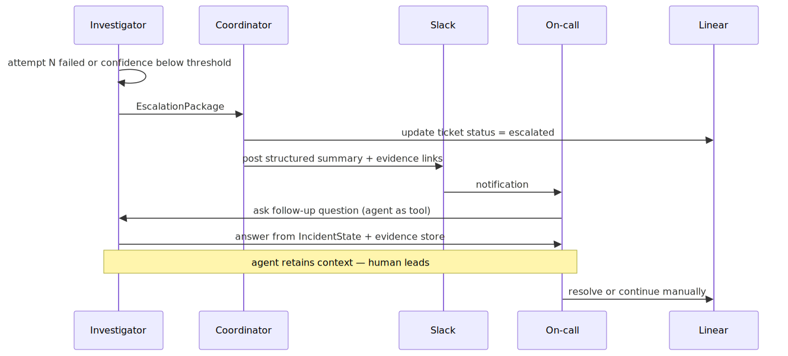

# DevOps Support Agent — Architecture

An agentic system that receives incidents from Slack, diagnoses against cloud infrastructure and the LGTM observability stack, and either opens a PR to fix the issue, executes an operational remediation, or escalates to an on-call engineer with structured context.

Designed around two load-bearing constraints:

1. **Observability data is enormous.** Raw log/trace/metric payloads must never touch agent context. Collectors summarise and reference; raw data lives in an evidence store.
2. **Context sprawl kills agentic systems.** Durable working memory lives in exactly one place (the orchestrator's `IncidentState`). Everything else is ephemeral and stateless, consuming task-local context and returning refined outputs.

---

## Design principles

- **One collector per data source, stateless.** Each invocation is `(question, scope) → (finding, evidence_id)`. No cross-invocation memory, no drift.
- **Evidence store as the shared substrate.** Raw payloads keyed by `evidence_id`. Agents pass references, never blobs.
- **Single source of truth for incident state.** The orchestrator holds `IncidentState`; every other node receives only the slice needed for its current task.
- **Refine, don't retain.** Collectors and subagents burn tokens on heavy local context, then return compressed findings, evidence refs, and next-step signals. The orchestrator carries forward those refined outputs, never raw logs or full prior transcripts.
- **Pre-flight remediation gate.** Not every investigation ends in a PR. A typed `RemediationPlan` decides: `pr`, `rollback`, `scale`, `flag_flip`, `runbook`, or `none`.
- **Separated lifecycle from investigation.** Intake, Investigator, and Coordinator are distinct prompts with distinct responsibilities. Conflating them causes prompt drift.
- **Structured escalation, not silent failure.** When the agent gives up, the human inherits hypotheses, evidence IDs, and attempt history.

---

## System architecture



---

## Component responsibilities

| Component | Stateful? | Role |
|---|---|---|
| **Intake agent** | no | Parse Slack, extract alert fields, create Linear ticket, bounce if unactionable |
| **Investigator** | yes (owns `IncidentState`) | Hypothesis loop — dispatch collectors, score hypotheses, decide when to hand off |
| **Collectors** | **no (ephemeral)** | One per data source. Answer a single hypothesis-framed question. Write raw to evidence store, return summary. |
| **Validator** | no | Given a candidate hypothesis and evidence refs, confirm or falsify. Runs counter-example searches. |
| **Remediation planner** | no | Decide the remediation *type* before any fix is attempted. Output a typed `RemediationPlan`. |
| **Dev agent** | no | Given a plan of type `pr`, produce a `FixProposal` (branch, diff, commit message, PR body). |
| **Fix verifier** | no | Run `terraform plan` / `helm template` / `kubectl diff` / tests. Classify failures as implementation defects vs diagnosis-invalidating signals. |
| **Coordinator** | no | Post-decision lifecycle: PR creation, reviewer feedback routing, ops execution, Linear updates, escalation. |

The split between Investigator and Coordinator matters: the Investigator's prompt is about *reasoning under uncertainty*; the Coordinator's is about *running a process*. Keeping them separate is what lets each stay narrow and evaluable.

---

## Memory architecture

Four layers, each with a different lifetime and retrieval pattern:



**Key boundaries:**

- Working state is the only memory always in context.
- Working state is composed of refined state: hypotheses, findings, decisions, and evidence references derived from prior subagent runs.
- Working state is checkpointed outside the live model context after every state transition so the orchestrator can resume after crashes, deploys, or long pauses.
- Semantic memory is retrieved per step against the current hypothesis, not pre-loaded.
- Episodic memory is queried once at intake: "have we seen this before?"
- Entity memory is cached per service; cheap to maintain, expensive to recompute per turn.
- Evidence store is durable but TTL-bounded (30 days is usually enough for an incident lifecycle plus postmortem).

### Memory substrate: Graphiti

Of the four layers, only **working state** lives in the orchestrator's process memory (`IncidentState`, checkpointed to Postgres for durability across restarts). The other three — semantic, episodic, entity — share a single backend: a temporal knowledge graph managed by [Graphiti](https://github.com/getzep/graphiti).

Why one backend for three layers: the questions alph-e actually asks cross the boundaries. *"Have we seen this alert shape before, and what did we believe about the affected service at that time?"* is an episodic query with an entity dimension. *"What depends on db-primary, and which of those services shipped in the last hour?"* is an entity query whose answer depends on which facts were valid at incident time. pgvector can approximate the semantic half with a timestamp filter, but a hand-rolled service graph plus pgvector plus episode vectors is three stores to keep consistent, and the seams are where retrieval breaks. Graphiti gives you bi-temporal edges (`valid_at` / `invalid_at` on every fact), entity extraction from unstructured text on ingest, and hybrid search (BM25 + vectors + graph traversal) in one place.

**What goes into the graph:**

- *Static seeding* — service catalog, runbooks, and prior postmortems loaded once as `EpisodeType.json` / `EpisodeType.text` episodes with `reference_time` set to when each artifact was authored. This resolves the "episodic memory bootstrap" open decision.
- *Intake alerts* — one episode per incoming alert at intake, so the graph can be queried against itself later for the "have we seen this" match.
- *Resolved incidents* — one episode per resolved incident, written by the Coordinator at close, containing the refined narrative: winning hypothesis, evidence IDs, remediation type, outcome.
- *Extracted facts* — dependency chains and failure modes surfaced by collectors during an incident, folded into an episode at close (never written directly by a collector).

**What stays out of the graph:**

- Raw observability payloads — stay in MinIO, referenced by `EvidenceRef.storage_uri`.
- `IncidentState` — stays in Postgres. Hot-path, single-writer, transactional; wrong shape for a graph.
- `EvidenceRef` metadata — stays in Postgres; referenced from graph entries only by `evidence_id` attribute.

**Attachment points in the runtime graph:**

- *Intake* — `client.search(query=alert.signature, valid_at=alert.fired_at, group_ids=[cluster_id])` answers the "have we seen this?" query with point-in-time semantics.
- *Investigator, per hypothesis* — `client.search_nodes(query)` and `client.search_facts(query, edge_types=["caused_by", "mitigated_by"])` return the subgraph relevant to the current hypothesis. Results fold into working state as refined facts, not blobs.
- *Coordinator, at close* — `client.add_episode(..., group_id=cluster_id)` with the episodic summary. Batched via `add_episode_bulk`; never on the hot path.
- *Scheduled reconciler* — a weekly job diffs the service-catalog source of truth against Graphiti's service nodes and writes corrective episodes. Without this, stale nodes linger whenever no invalidating episode naturally arrives.

**Cost discipline.** Entity extraction on ingest calls an LLM every time. Three rules keep the spend bounded to the low tens of dollars per month at alph-e's incident volume: episodes are incident-level, not collector-level (one at intake, one at close); extraction runs on a cheap model (Haiku), configured independently of the orchestrator model binding; writes at close are batched via `add_episode_bulk` at the post-resolve tick, not during active investigation.

**Backend choice.** FalkorDB for the local demo — Redis-based, sub-10ms reads, small footprint, which matters alongside the Postgres and MinIO already running in the agent-infra namespace. Neo4j for cloud — default Graphiti backend, best ecosystem, handles alph-e's expected graph sizes without tuning. Neptune is out (unnecessary AWS coupling that the rest of alph-e has avoided). Kuzu is embedded and cheap but loses the shared-service ergonomics the other stores assume.

**MCP integration.** Graphiti ships an MCP server (`mcp_server/` in the Graphiti repo). Run it alongside the existing Loki / Prom / Tempo / Grafana MCP servers; the Investigator and Intake agents call its tools (`add_episode`, `search_nodes`, `search_facts`, `get_episodes`) the same way they call any other data-source MCP. No new client library in the agent runtime.

**Namespacing.** One `group_id` per cluster for the first pass (`cluster_id`). Graphiti supports crossing multiple `group_ids` in one query, so adding a per-team dimension later is non-breaking.

---

## State schema



**Deliberate choices:**

- `IncidentState` is the only durable container. Collectors receive a `CollectorInput` slice, not the whole state.
- `IncidentState` stores refined outputs from prior steps, not raw observability payloads or full collector transcripts.
- `IncidentState` is persisted as an external checkpoint after each orchestrator step; rehydration rebuilds the live prompt from state plus referenced evidence.
- Checkpoint ordering: evidence-store writes commit *before* the state checkpoint that references them, so rehydration never points at missing blobs. A subagent call in flight at crash time is re-dispatched on restart — idempotency on `(incident_id, collector_name, question, time_range, scope, environment_fingerprint)` makes the retry safe.
- Checkpoint cadence matches the smallest resumable unit — one per orchestrator step in the runtime, one per routing decision in the build fleet. Anything finer-grained wastes I/O; anything coarser loses work on restart.
- `ActionIntent` is the audit unit for mutations: hash, signer, approval record, and execution outcome are part of `IncidentState.actions_taken` alongside the `Action` entry that realised it.
- `EvidenceRef` is a pointer, not content. Raw data lives at `storage_uri`; `expires_at` forces an explicit retention decision.
- `RemediationPlan.type = none` is a valid output — "investigated, nothing to automate, handing off."
- `investigation_attempts` is the single attempt counter, deliberately not duplicated across `FixProposal` or `CollectorInput`.
- `EscalationPackage` is structured so a human inherits context, not just a failure message.

---

## Collector contract

Collectors are pure-ish functions. Each call is a fresh context. The contract is narrow and typed:

```python
# Input
CollectorInput(
    incident_id="inc_2a91",
    question="Is db-primary showing connection errors in the last 15m?",
    hypothesis_id="hyp_3",
    time_range=TimeRange("14:00", "14:15"),
    scope_services=["db-primary"],
    environment_fingerprint=EnvironmentFingerprint(
        cluster="prod-eu-west-1",
        account="123456789012",
        region="eu-west-1",
        deploy_revision="api@v2.14.3",
        rollout_generation="api-7f9a",
    ),
    max_internal_iterations=5,
)

# Output
CollectorOutput(
    finding=Finding(
        collector_name="loki",
        summary="847 'connection refused' errors, onset 14:02:17, affecting 3 upstream services",
        evidence_id="ev_8f2a",
        confidence=0.92,
        suggested_followups=[
            "check db-primary pod status",
            "correlate with deploys in window",
        ],
    ),
    evidence=EvidenceRef(
        evidence_id="ev_8f2a",
        storage_uri="s3://incidents/ev_8f2a.jsonl",
        content_type="application/x-ndjson",
        size_bytes=4_821_334,
        expires_at="2026-05-21T00:00:00Z",
    ),
    tool_calls_used=3,
    tokens_used=1_842,
)
```

**Why `max_internal_iterations`:** collectors are allowed to iterate (run 2–3 refined queries before returning) because good log triage genuinely needs it. But the cap is explicit — without it, a collector can quietly blow up its own context window chasing a dead hypothesis. Five is usually enough; hard stop.

**Caching:** collector calls are memoised on `(incident_id, collector_name, question, time_range, scope, environment_fingerprint)`. Five-minute TTL. `environment_fingerprint` should capture the cluster / account / region plus freshness signals like deploy revision or rollout generation so cached findings are invalidated when the system materially changes.

---

## Remediation decision

The pre-flight gate that prevents the system from forcing PRs when the right action is operational:



**Rules:**

- Only `type = pr` goes to the Dev agent.
- Operational actions (`rollback`, `scale`, `flag_flip`, `runbook`) go to the Coordinator and execute against cloud/k8s APIs with full audit logging in `IncidentState.actions_taken`.
- `requires_human_approval=True` on the plan forces a Slack confirmation before the Coordinator acts — default `True` for anything that mutates production.
- `type = none` is a clean escalation path when the agent has investigated but has no actionable remediation.

**Safety contract for operational actions:**

- Every mutable action is materialised as a signed `ActionIntent` with a stable hash over target, parameters, expected effect, rollback hint, and expiry.
- The **Planner** signs the intent; the **Coordinator** verifies the signature before executing. Keys are held by distinct identities so a compromised Coordinator cannot forge intents.
- Human approval binds to that exact `ActionIntent` hash; if the plan changes, approval is invalidated (`approval_status = invalidated`) and must be re-issued.
- Default approval validity: 15 minutes from grant, or until the next precondition check fails — whichever is sooner. `ActionIntent.expires_at` encodes the ceiling.
- Coordinator executions use `ActionIntent.hash` as the idempotency key so retries cannot fan out duplicate mutations.
- Mutations run under a dedicated least-privilege service identity, never a human engineer's ambient credentials.
- Immediately before execution the Coordinator re-checks preconditions against live state. Stale plans are rejected and routed by *what changed*:
  - **Diagnosis-invalidating change** (the root-cause observation no longer holds) → Investigator.
  - **Parameter-only change** (target pod renamed, replica count already adjusted) → Planner for a fresh `ActionIntent`.
  - **Already-resolved** (the bad deploy was rolled back by a human, the flag is already flipped) → Coordinator short-circuits to `resolved` with a `no_op` action record; no round-trip.
- Partial success triggers compensation: the Coordinator executes the inverse derived from `ActionIntent.rollback_hint`, records both the forward and compensating actions in `IncidentState.actions_taken`, and escalates. No unbounded self-healing loops.

---

## Escalation path

Escalation is a **handoff**, not a failure. The on-call engineer receives a structured package and the agent stays available as a tool.



**What the EscalationPackage contains** (not "I failed 3 times"):

- Hypotheses considered, with scores and current status.
- Key findings with evidence IDs (linkable to Grafana/Loki dashboards).
- Attempts made, each with its rejection reason.
- Current working theory and confidence.
- Suggested next steps the agent couldn't execute itself (missing permissions, genuine ambiguity, needs human judgement).

---

## Subagents and token management

Investigation phases that generate a lot of tokens internally but only need to return a conclusion run as **subagents with their own context windows**. The orchestrator sends a task seeded from the current refined incident state, the subagent burns tokens on heavy local context, and returns only a structured finding.



**Cost tactics:**

| Tactic | Impact |
|---|---|
| Prompt caching on system prompt, tool defs, service catalog | ~90% discount on the stable prefix — largest single lever |
| Tiered models: small for orchestrator routing, larger for hypothesis synthesis | Reserves expensive tokens for hard reasoning |
| Parallel collector dispatch when hypotheses are independent | Latency win; no token penalty |
| Server-side aggregation (LogQL counts, PromQL rates) instead of raw data | Push computation to data plane, not the LLM |
| Sliding window + rolling summary on long incidents | Past turns compressed into "what we've learned so far" paragraph |
| Collector output cache, 5-min TTL, keyed on incident + scope + environment fingerprint | Free for re-framings within the same incident without serving stale cross-environment results |

---

## Key routing decisions

A few non-obvious edges worth calling out because they're the ones that typically get wired wrong:

| From | Condition | To | Why |
|---|---|---|---|
| Reviewer | changes on the **fix** | Dev agent | Don't re-investigate for a typo fix |
| Reviewer | challenges the **root cause** | Investigator | Full rethink warranted |
| Verifier | implementation defect (`VerifierResult.kind = implementation_error`) | Dev agent | Diagnosis still stands; patch the fix |
| Verifier | diagnosis invalidated (`VerifierResult.kind = diagnosis_invalidated`) | Investigator | Dry-run evidence contradicted the current root-cause theory |
| Planner | `type = none` | Coordinator → escalation | Not a failure; a legitimate outcome |
| Investigator | attempts exhausted | Coordinator (not directly to Slack) | Coordinator owns lifecycle; escalation is a lifecycle event |
| On-call | follow-up question | Investigator | Agent stays available during handoff |

---

## Failure modes to instrument

The happy path is easy. These are the paths that determine whether the system actually works in practice:

- **Collector returns empty / no signal.** Does the Investigator correctly update hypothesis status, or does it loop?
- **Hypotheses all score below threshold.** Does the system correctly hand off as `type = none` rather than forcing a weak PR?
- **Verifier fails repeatedly on the same proposal.** Cap Dev → Verifier iterations at 3; escalate beyond.
- **Verifier invalidates the diagnosis.** The verifier must be able to reopen investigation, not just request implementation tweaks.
- **Reviewer requests changes ambiguously.** Default to "changes on fix" route; only re-open investigation on explicit challenge to root cause.
- **Orchestrator asks bad collector questions.** "Show me logs from db-primary" is a UI query, not a hypothesis test. Invest in an eval set of past incidents to check question quality.
- **Evidence store GC-ing mid-incident.** Lifecycle rules must be longer than expected incident duration + postmortem window.
- **Approved action executes against changed reality.** Re-check preconditions immediately before mutation; default approval validity 15 min or until a precondition re-check fails.
- **Already-resolved race.** Fresh precondition check reveals the bad deploy was already rolled back by a human — Coordinator must short-circuit to `resolved` rather than round-trip through Investigator/Planner.
- **Crashed with subagent in flight.** State checkpoint must commit *after* evidence writes, and subagent dispatch must be keyed on `(incident_id, collector_name, question, time_range, scope, environment_fingerprint)` so restart re-dispatch is idempotent.
- **Graphiti ingest spend runaway.** If any collector ever writes directly via `add_episode`, extraction-LLM spend climbs fast. Enforce at the collector base class: no Graphiti client on ephemeral nodes. Episodes only written at intake and by the Coordinator at close.
- **Stale entity nodes in the graph.** Facts supersede via `invalid_at` on re-ingest, but nodes whose facts never get contradicted stay. A weekly reconciler must diff the service-catalog source of truth against Graphiti's service nodes and write corrective episodes, or the entity layer drifts.

---

## Open decisions

Things the architecture deliberately leaves to you:

1. **Collector iteration model.** Single-shot per call, or iterative with a cap? Recommend iterative with `max_internal_iterations=5`. More powerful for log triage; still bounded.
2. **Human-in-the-loop mode for escalation.** Does the agent stay active as a tool, or is escalation a full handoff? Recommend the former — keeps institutional memory.
3. **Auto-execute vs. auto-propose for operational actions.** `rollback` and `scale` can be safe to auto-execute; `flag_flip` often needs approval. Default `requires_human_approval=True`; relax per action type with deliberation.
4. **Which model tier per role.** MVP1 uses Claude Sonnet everywhere to keep the PoC simple and measurable. Post-MVP: Haiku for Intake and Coordinator routing, Sonnet for Investigator and most collectors, Opus only for hard hypothesis synthesis. Tiering only after there's a baseline to compare against.
5. **Episodic memory bootstrap.** Does the system start cold, or seed from existing postmortems? Seeding is worth the one-time ETL cost — past incidents are where the agent gets smarter. Concretely: ingest each postmortem as one `EpisodeType.text` Graphiti episode with `reference_time` set to when the incident occurred and `group_id = cluster_id`.
6. **Graph backend.** FalkorDB for local (Redis-based, sub-10ms reads, small footprint); Neo4j for cloud (default Graphiti backend, best ecosystem). Revisit only if graph size or query patterns outgrow one of them — unlikely at alph-e's incident volume.
7. **Extraction model binding.** Haiku for Graphiti's entity/relation extraction on ingest. Kept separate from the orchestrator model so tiering the investigator later doesn't also mean re-tuning extraction prompts.
8. **`group_id` scope.** Per cluster (`cluster_id`) for the first pass. Add a per-team or per-environment dimension later if retrieval needs it; multi-group queries are non-breaking.
9. **Should collectors ever write to the graph directly?** No, in MVP1 and probably beyond. Deferred learning at incident close preserves the "collectors are stateless, write nothing durable" contract. Revisit only if we see a class of facts that have to be captured mid-incident because close-time reconstruction would lose them.

---

## Suggested stack

| Layer | Choice | Notes |
|---|---|---|
| Agent framework | PydanticAI or LangGraph | Both have first-class typed state; LangGraph is better at explicit graph control flow |
| LLM | Anthropic Claude Sonnet (single tier for MVP1) | Single model across all roles until there's a baseline to tier against; prompt caching is the killer cost lever regardless |
| Semantic + episodic + entity memory | Graphiti on FalkorDB (local) / Neo4j (cloud) | See "Memory substrate: Graphiti" above. Bi-temporal edges, hybrid search, entity extraction on ingest. Extraction model should be Haiku, not the orchestrator model. |
| Evidence store | S3 / MinIO (blobs) + Postgres (metadata) | 30-day lifecycle rules; MVP1 runs in-cluster via Helm |
| Cloud / k8s tools | MCP servers per provider | Composable, swappable, auditable |
| Observability tools | MCP servers for Grafana / Loki / Tempo / Prometheus | Same pattern |
| Code / PR | GitHub API + Claude Code CLI (optional) | Claude Code handles branch / commit / PR mechanics well |
| Ticketing | Linear API | Updates at intake, planning, PR open, resolution, escalation |
| Reference to study | HolmesGPT (Robusta) | Good prior art for k8s + observability diagnosis; steal the runbook retrieval pattern |

---

## MVP1: PoC deployment

MVP1 is a proof-of-concept on a small demo cluster. The goal is to exercise the full graph end-to-end against canned incidents and validate the architecture's load-bearing claims (bounded context, typed contracts, evidence-by-reference, pre-flight gates). It is not production and is not tuned for cost or latency.

### Model selection

**Claude Sonnet for every role.** One model across Intake, Investigator, collectors, Planner, Dev, Verifier, and Coordinator. Rationale:

- Sonnet is cheap enough per token that the PoC's end-to-end spend is bounded, and smart enough that no role is the weak link.
- Avoids the multi-model variance problem — if a PoC misfires, we know it's the prompt or the graph, not a model mismatch.
- Prompt caching applies to the stable system/tool prefixes across all roles, which is the real cost lever.
- Tiering to Haiku on routing roles (Intake, Coordinator) and Opus on synthesis (hard hypothesis work) is a post-MVP optimisation — requires an MVP1 baseline to measure against.

No local inference in MVP1. Explicit non-goal.

### Demo cluster

A small Kubernetes cluster (kind / k3d / minikube, or a single-node EKS/GKE dev cluster) running:

- 2–3 toy services with intentionally breakable failure modes (OOM, bad deploy, dependency timeout).
- Grafana LGTM stack or the Grafana Cloud free tier as the observability backend.
- A seed incident generator that triggers each failure mode on demand.

### In-cluster infrastructure

The k3d cluster hosts both the target environment (demo workloads + monitoring stack) and the agent-side infrastructure:

| Component | Namespace | Purpose | Access (MVP1) |
|---|---|---|---|
| **Postgres** | `agent-infra` | Evidence metadata + LangGraph checkpoints | `task agent-infra:postgres` (localhost:5432) |
| **MinIO** | `agent-infra` | Evidence blob storage with 30-day lifecycle | `task agent-infra:minio` (API: localhost:9000, console: localhost:9001) |
| **FalkorDB** | `agent-infra` | Graphiti's episodic/semantic/entity memory | Not yet deployed (see `backlog/WI-016-agent-infra-falkordb.yaml`) |
| **Agent** | host (MVP1) / in-cluster (MVP2) | Orchestrator + intake + reasoning nodes | Host-side uv process in MVP1 |

- **Postgres**: Bitnami postgresql chart with pgvector image override (`pgvector/pgvector:pg16`). 4Gi PVC on local-path. Configuration at `agent-infra/values/postgresql.values.yaml`.
- **MinIO**: Official minio/minio chart, standalone mode with 10Gi PVC. Creates `incidents` bucket natively. 30-day lifecycle rule applied via post-install Job at `agent-infra/manifests/minio-lifecycle-job.yaml`.
- **FalkorDB**: Graph backend for Graphiti's memory layer. Runs in-cluster in the `agent-infra` namespace alongside Postgres and MinIO. Deployment is tracked as WI-016 — not yet implemented.

**Bring-up**: `task up` orchestrates cluster creation, monitoring installation, agent-infra deployment, and demo workload. Host-side access to cluster services is via port-forwards during MVP1 (agent on host), transitioning to internal service DNS in MVP2 (agent in-cluster).

### What MVP1 deliberately does *not* cover

- **No local inference.** Addressed post-MVP if token spend on real incident volume justifies the ops burden.
- **No model tiering.** Sonnet-everywhere until there's data showing where tiering pays off.
- **No production mutations.** `requires_human_approval=True` on every `ActionIntent`; the Coordinator's cloud-mutation paths are stubbed to `dry_run` against the demo cluster.
- **Single-cluster, single-environment.** `environment_fingerprint` still encodes cluster/region/revision, but there's only one environment, so cross-environment cache poisoning can't be exercised until MVP2.
- **Episodic memory cold-start.** No postmortem ETL in MVP1 — the system learns from the canned incident set only.

### Post-MVP: mixed deployment

Once the PoC validates the graph, the practical production pattern is **local collectors, cloud orchestrator**:



Collectors are high-volume and mechanical — they benefit from being local (no per-call cost, low latency, data never leaves the VPC). The orchestrator and Dev agent are low-volume but high-stakes — they benefit from frontier-model reasoning. Typically cuts cloud spend 70%+ versus all-cloud while keeping hard-reasoning quality where it matters. Config surface lives on `IncidentState.phase` so model binding is declarative, not hardcoded into prompts.

Not in scope for MVP1.

---

## Related documents

- **`devops-agent-build-fleet.md`** — companion doc describing a fleet of specialist agents that constructs this runtime system. Mirrors the same patterns (narrow ephemeral specialists, stateful orchestrator, typed work-item contracts, verifier loop). Useful if you're building with Claude Code subagents, Archon Agent Work Orders, or a custom multi-agent build pipeline.
