# DevOps Agent — Build Fleet

Companion to `devops-agent-architecture.md`. Describes a fleet of specialist agents that builds the runtime system, mirroring the same architectural patterns: narrow ephemeral specialists, stateful orchestrator, shared artifact store, verifier loop.

The symmetry is deliberate. If the patterns that work for incident response (bounded context, typed contracts, evidence-by-reference, pre-flight gates) also work for software construction, that's a good signal the patterns are load-bearing rather than incidental.

---

## Fleet composition



---

## Mapping to runtime patterns

| Runtime concept | Build fleet equivalent |
|---|---|
| `IncidentState` | `BuildState` — backlog, completed work items, ADRs, current focus |
| Collectors (ephemeral) | Specialists (ephemeral) — one per work item, no cross-task memory |
| Evidence store | Git repo + CI results — durable, referenced by commit SHA |
| `RemediationPlan` | ADR — typed decision artifact before implementation |
| Fix verifier | Reviewer agent — runs tests, checks acceptance criteria |
| PR reviewer (human) | PR reviewer (human) — same role |
| Escalation package | Unresolved ADR sent to product owner |

---

## Tech Lead responsibilities

The Tech Lead is the only stateful node. Its context holds `BuildState`, not raw specialist transcripts. It accumulates refined outputs from prior work items, then sends only the task-local slice needed for the next specialist call. `BuildState` is checkpointed externally after each routing decision so the orchestrator can resume after interruption from backlog, ADR, PR, and CI metadata plus its last persisted state. Checkpoint cadence mirrors the runtime architecture — one per routing decision here, one per orchestrator step there — in both cases matching the smallest resumable unit. Its job is decomposition and routing:

1. Receive high-level goal from product owner ("implement runtime per architecture doc").
2. Decompose into typed `WorkItem`s, seed the backlog.
3. Resolve the dependency DAG — which items can run in parallel, which block others.
4. Dispatch ready items to specialists with minimal context (just the relevant ADRs + interface contracts).
5. On specialist completion, update `BuildState`, propagate new unblocked items.
6. On reviewer rejection, route feedback to the specialist (not re-decompose).
7. On architectural ambiguity, draft an ADR and escalate to the product owner.

What the Tech Lead does *not* do: write code. Dispatch-only. The moment it starts editing files, its context bloats with implementation details and the fleet falls apart.

---

## WorkItem contract

What the Tech Lead dispatches to each specialist:

```python
class WorkItem:
    id: str
    title: str
    owning_component: str               # e.g. "collectors.loki"
    acceptance_criteria: list[str]      # testable, specific
    interface_contracts: list[str]      # relevant Pydantic models, MCP schemas
    relevant_adrs: list[str]            # ADR IDs, not full text
    allowed_paths: list[str]            # filesystem scope
    blocked_paths: list[str]            # things to not touch
    depends_on: list[str]               # other WorkItem IDs
    estimated_complexity: str           # small / medium / large
    max_iterations: int                 # attempts before escalation
```

The specialist's input is *this item plus the files under `allowed_paths`*. It never sees the full backlog, never sees other specialists' raw working history, never sees ADRs it doesn't need. This is the same discipline we imposed on runtime collectors.

**Dispatch idempotency.** After a Tech Lead restart, reconciliation may re-dispatch a `WorkItem` whose earlier dispatch completed work the checkpoint hadn't captured. Specialists must treat `WorkItem.id` as an idempotency key: if a branch `specialist/<component>/<id>` already exists, the specialist reconciles with it (either resumes the existing PR or no-ops if already merged) rather than opening a duplicate. Same pattern as the Coordinator's `ActionIntent.hash` idempotency at runtime.

On completion, the specialist returns refined outputs for the Tech Lead to fold into `BuildState`: completed work, decisions made, interfaces satisfied, blockers discovered, and artifact references such as commit SHAs, PR URLs, and CI results.

The specialist's output is a PR. Not a description of a PR, not a diff in chat — an actual branch with commits, opened against main, targeting only `allowed_paths`.

---

## Execution DAG

Phases exist because some work is genuinely serial (schema blocks everything; infra blocks anything that needs a running stack). Within a phase, specialists run in parallel.



Phase 5 is interesting: the eval agent can start building the test corpus as soon as the schema exists. Golden-path incidents are just fixtures under the `IncidentState` type. This gives the reviewer something to run tests against from phase 2 onward, rather than discovering integration problems at the end.

---

## Specialist prompt template

Every specialist gets the same structural prompt. Only the `WorkItem` and the file scope change.

```
You are building a single component of a DevOps incident-response system.

Your work item:
  <WorkItem serialised>

Relevant interface contracts (do not modify these, only consume them):
  <Pydantic model definitions for the types you interact with>

Relevant ADRs (architectural decisions already made):
  <ADR references, not full text unless needed>

Your filesystem scope:
  allowed: <paths>
  blocked: <paths>

Acceptance criteria (must all pass):
  <list>

Ground rules:
- Do not modify files outside allowed paths.
- Do not introduce new external dependencies without drafting an ADR.
- Do not redesign interfaces — if a contract is wrong, stop and report.
- Every PR must include tests covering the acceptance criteria.
- Commit messages follow <project convention>.

Output:
- A git branch named specialist/<component>/<work_item_id>
- Commits implementing the work item
- A PR opened against main with body summarising what you did and
  what you explicitly did NOT do.

If you cannot complete within max_iterations, stop and produce a
BlockedReport with what you tried, what failed, and what decision
you need.
```

The "do not redesign interfaces — stop and report" line is the single most important rule. Specialists that quietly reshape contracts to make their work easier will silently break the system's assumptions. A specialist that *notices* a contract is wrong and escalates is doing the right thing.

---

## Reviewer agent

The reviewer is also ephemeral. One invocation per PR.

Its job is the same as a fix-verifier in the runtime system:

- Run the test suite scoped to the PR's acceptance criteria.
- Run type-check and lint.
- Check the PR body against the WorkItem — did it deliver what was asked, and nothing more?
- Check the blast radius — are changes only within `allowed_paths`?
- Run the eval harness against any component it touches, if applicable.

Output is one of three decisions:

- `approve` — Tech Lead merges, updates `BuildState`.
- `request_changes` — routed back to the specialist with specific failures (not a redesign).
- `escalate_architectural` — the PR reveals a problem with the contract or ADR, not the implementation. Tech Lead opens a new ADR; human is pulled in.

That third path matters. Without it, specialists and reviewers can enter a loop trying to satisfy an unsatisfiable acceptance criterion because the underlying design is wrong.

Reviewer approval is local, not sufficient for merge. Final merge is gated by CI, contract tests for touched interfaces, and merge-queue revalidation against the current base branch.

---

## Shared substrate

| Artifact | Where it lives | Who writes | Who reads |
|---|---|---|---|
| Git repo | GitHub | Specialists (via PR) | Everyone |
| ADRs | `docs/adr/NNNN-*.md` | Tech Lead, escalated by reviewers | Specialists, reviewer |
| Backlog | `backlog/*.yaml` or Linear | Tech Lead | Tech Lead (private) |
| `BuildState` | External checkpoint + Tech Lead working memory | Tech Lead | Tech Lead |
| Test corpus | `tests/fixtures/incidents/` | Eval agent | Reviewer, specialists |
| CI pipeline | GitHub Actions | Infra agent | Reviewer |

ADRs are load-bearing. They're the equivalent of the architecture doc's typed state: a record of decisions that specialists consume as context. Numbering matters (`0001-use-pydanticai.md`, `0002-evidence-store-is-s3-compatible.md`) because specialists reference them by ID.

Parallelism needs one more constraint beyond path scoping: interface ownership. Shared contracts, generated code, and config roots should have a single owning workstream or a required merge-queue contract test before downstream PRs can land.

---

## Tool surface per agent

Narrower is better. Each specialist gets only the tools it needs:

| Agent | Tools |
|---|---|
| Tech Lead | read ADRs, read backlog, write ADRs, dispatch WorkItem, update BuildState |
| Schema | read/write in `schemas/`, run `mypy`, run unit tests |
| Infra | read/write in `infra/`, docker, docker-compose, test stack boot |
| Evidence store | read/write in `evidence/`, Postgres CLI, MinIO CLI |
| Collectors | read/write in `collectors/<name>/`, HTTP client, run collector tests |
| Agent builders | read/write in `agents/<name>/`, agent framework, eval runner |
| Integrations | read/write in `integrations/<name>/`, external API client |
| Eval | read/write in `tests/`, run full test suite, access seed corpus |
| Docs | read/write in `docs/`, read entire repo (read-only elsewhere) |
| Reviewer | read entire PR diff, run test suite, run eval harness, cannot write |

The Docs agent is the one exception to narrow scoping — it needs broad read access because its job is synthesis. It still cannot write outside `docs/`.

---

## How this actually runs

Three implementation options, in order of simplicity:

**Option 1: Claude Code with subagents.** Use Claude Code as the Tech Lead. Its `Task` tool spawns subagents with isolated contexts; each subagent gets a `WorkItem` as its prompt and a scoped filesystem. Simplest path, no extra infra needed. Good for a small fleet (≤10 concurrent specialists).

**Option 2: Archon Agent Work Orders.** The repo from the start of this conversation actually implements this pattern. Its Agent Work Orders service drives Claude Code CLI against a repo with ticket-based work items. Fits naturally because it's designed for exactly this workflow — parallel coding agents working against a shared knowledge base (ADRs) and task system. Full-circle use of Archon: the thing we said wasn't a good runtime DevOps agent is a reasonable *build* orchestrator.

**Option 3: Custom orchestrator with LangGraph/PydanticAI.** Build the Tech Lead as its own agent using the same framework you'll use at runtime. Most work, but eats your own dogfood — any problems you hit in the build fleet will show up in the runtime too, which is useful signal.

Recommended: option 1 for the first pass, option 3 if the fleet grows past ~15 concurrent specialists or you want cross-run persistence.

Whichever option you choose, the orchestrator needs resumability as a first-class feature: rebuild `BuildState` from persisted checkpoints, backlog state, ADR history, open PRs, and CI results rather than relying on a single long-lived interactive session.

---

## Model selection (MVP1)

**Claude Sonnet for every role in the fleet** — Tech Lead, Reviewer, and all specialists. Same reasoning as the runtime: one model keeps the PoC measurable, prompt caching hits the stable system/tool prefix across every call, and Sonnet is cheap enough that fleet-wide usage is bounded.

Why not tier down on mechanical specialists (infra boilerplate, docs)? Build-time mistakes compound — a specialist that silently reshapes an interface breaks downstream specialists hours later. The MVP1 call is to spend the extra Sonnet tokens on reliability during construction and revisit tiering only after there's a baseline to compare against.

Post-MVP tiering candidates, once validated: Haiku for docs/boilerplate specialists, Opus for hard agent-builder and schema work. Never local models for anything touching schema or interface contracts.

---

## Failure modes to instrument

Same discipline as the runtime doc — the happy path is easy, the edges are where the system earns trust:

- **Specialist exceeds `max_iterations` silently.** Must produce a `BlockedReport`, not just stop. Tech Lead should flag stuck work items on every tick.
- **Specialist modifies files outside `allowed_paths`.** CI must enforce path scoping independent of the agent's self-report. Trust but verify.
- **Reviewer approves despite failing eval.** Reviewer's approval must be contingent on CI green, not its own judgement. Hard interlock.
- **Tech Lead starts editing code.** Detect by monitoring its tool calls — if it reaches for file-write tools outside `docs/adr/`, something has gone wrong in the prompt.
- **ADR drift.** Specialists should reject WorkItems whose `relevant_adrs` contradict the current code. Tech Lead should periodically re-validate ADRs against the codebase.
- **Parallel specialists conflict.** Path scoping prevents most cases, but shared files (pyproject.toml, docker-compose.yml) are conflict magnets. Either serialise work items touching those files, or give a single "config maintainer" specialist exclusive write access.
- **Parallel PRs drift semantically while staying path-clean.** Merge queue plus contract tests on shared interfaces must catch this before merge.
- **Tech Lead restart loses orchestration progress.** Recovery should reconcile persisted `BuildState` with backlog, ADRs, open PRs, and CI before dispatch resumes.

---

## Initial backlog seed

To kick the fleet off, the product owner provides the Tech Lead with the architecture doc and a skeleton backlog. Roughly:

```yaml
- id: WI-001
  title: Pydantic models for IncidentState, Hypothesis, Finding, etc.
  component: schemas
  depends_on: []
  acceptance:
    - All types from architecture class diagram present
    - mypy --strict passes
    - Round-trip JSON serialisation tested

- id: WI-002
  title: Docker compose with Ollama, Postgres+pgvector, MinIO
  component: infra
  depends_on: []
  acceptance:
    - docker compose up boots clean
    - Health checks pass for all services
    - Env-driven model selection

- id: WI-003
  title: Evidence store interface (Postgres metadata, MinIO blobs, TTL)
  component: evidence
  depends_on: [WI-001, WI-002]
  acceptance:
    - write/read/delete/list by evidence_id
    - TTL enforced via lifecycle rule
    - content_type and size_bytes populated correctly

# ... WI-004 through WI-00N for each component
```

The Tech Lead expands this into the full DAG, adding items for tests, docs, and integration glue as it goes.

---

## Why this will actually work

The reason to believe this is not theatre is that *the pattern has already been stress-tested* in the thing you're building. If narrow ephemeral specialists with typed contracts can diagnose a production incident under time pressure, they can build a feature branch under acceptance criteria. Both problems are "reason carefully, produce a small correct artifact, hand off cleanly." The only substantive difference is that incidents are seconds-to-minutes and builds are hours-to-days — which means the build fleet has *more* slack for things like retries and human review, not less.

The trap to avoid is giving the Tech Lead implementation authority. The moment it writes code, it starts reasoning about the whole codebase, its context bloats, it loses the plot on the DAG. Keep it as a dispatcher. Narrow. Ephemeral specialists. Shared artifact store. Verifier loop. Same discipline top to bottom.
